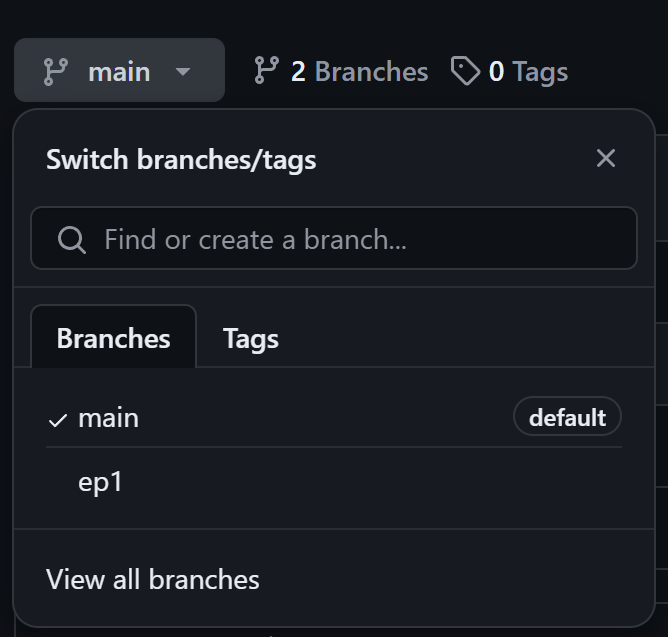

# RPG in Go
A [video series](https://youtube.com/playlist?list=PLvN4CrYN-8i7xnODFyCMty6ossz4eW0Cn&si=xuvPY13Kodf5nPzH) by me!

# Repository Structure

This project uses git branches to manage the different episodes. Click on the branch labelled `main` in the topleft and select the appropriate episode:

# License

All code is licensed under [MIT](./LICENSE)

# Support

All content revolving around this series is given for free. It would be a huge help to support in ways that you can, including:

- Subscribing to my [channel](https://youtube.com/@codingwithsphere)
- Sharing my content
- Supporting me on [Patreon](https://patreon.com/codingwithsphere)